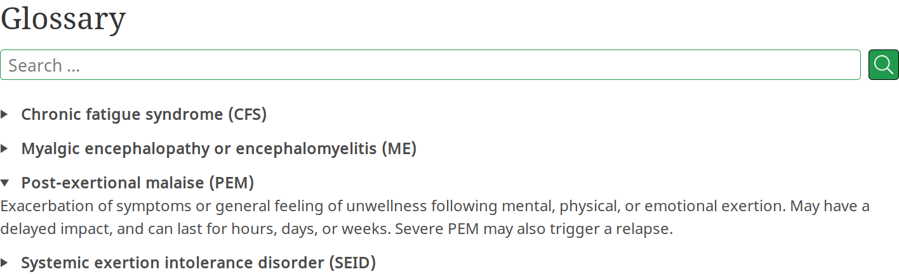

# <sup>Multilingual</sup> Glossary Plugin
---
## This fork defers from the original in three main ways:
1. Multilingual support, including in the backend.
2. Definition pop-ups/tooltips are positioned dynamically using JavaScript to ensure visiblity. They close when you click outside the tooltip.
3. Fixes [the bug](https://github.com/N-Parsons/grav-plugin-glossary/issues/1) that caused definitions to get added to summaries in blog pages.

## TODO
1. Supported languages are `en`, `es`, `pt-br`, and `ar`. Default/fallback is `en`. Ideally this wouldn't be hard-coded. It should automatically support all languages enabled in Grav.
2. There's currently a minor bug in the backend wherein the definition doesn't appear until you click inside the textbox. I believe this is related to the initial hidden state of the definition in the frontend.
3. Markdown support seems to be broken in the finally rendered tooltip.
4. The JS file in the root directory must be copied to your theme's `assets` directory and manually plugged into the bottom of the `item` template. This is due to [the bug](https://github.com/N-Parsons/grav-plugin-glossary/issues/1). This should be handled more smoothly.
5. I fixed [the bug](https://github.com/N-Parsons/grav-plugin-glossary/issues/1) by using a JavaScript file that injects the entire glossary into the HTML. This allows me to control the context in which the glossary plugin activates, so that it doesn't activate outside of `item` pages. I'm sure there's a better way to do this without increasing DOM size. I don't know how. Which is why I left [my issue](https://github.com/N-Parsons/grav-plugin-glossary/issues/1) open on the original repo.
6. I don't use the glossary feature so I have no idea what state it's in currently. I only use the "optional `<abbrev>` tags".

---

The **Glossary** Plugin for [Grav CMS](http://github.com/getgrav/grav) allows you to maintain a glossary of terms that can be formatted into a searchable page, as well as optionally inserting `<abbrev>` tags into your content via Markdown Extra.

## Example output




## Installation

### GPM Installation (Preferred)

The simplest way to install this plugin is via the [Grav Package Manager (GPM)](http://learn.getgrav.org/advanced/grav-gpm), either through the Admin panel, or via your system's terminal by navigating to your site root and running:

```sh
  bin/gpm install glossary
```

### Manual Installation

Alternatively, you can download a zip of this repository, unzip it to `/your/site/grav/user/plugins`, and rename the folder to `glossary`.


## Usage

### Glossary terms

Glossary terms are defined in the plugin configuration via the `definitions` key. This should contain a list of key-value pairs that define each term, as shown below:

```yaml
definitions:
  -
    term: Some long complicated term
    abbrev: SLCT
    definition: "Definition of the term (can include markdown)"
```

The `term` is required, and you should define at least one of `abbrev` and `definition`. Items that have only a term and abbreviation are excluded from the glossary, but will be applied to your pages as abbreviations if this functionality is enabled.

The definition will be formatted with Markdown when inserted it into the template, so you can include links, emphasis, etc.


### Glossary page

Adding a glossary page to your site is as simple as creating a page with the `glossary_plugin` template.

There are two modes for printing the glossary contents, which are set in the plugin configuration via the `item_template` key:

- `dt_dd`: This uses HTML definition lists (ie. `<dl>`, `<dt>`, `<dd>`).
- `details_summary` makes use of the accordion panel-like functionality of `<details>` and `<summary>` tags. Some browsers, such as Edge, don't support the opening and closing of `details` tags, but fallback to having them always open, so the content should always be accessible to visitors.

Glossary items are listed in alphabetical order. If a glossary item has no definition, it is ignored by the template and thus excluded from the glossary page. If an abbreviation is defined, this will be included in brackets after the term.

You are of course free to write your own templates based on the ones provided if you want. If you think that your changes are more widely useful, a pull request would be welcomed.


### Site-wide abbreviations

You can add abbreviation tags `<abbrev>` to all abbreviations on your site by enabling Markdown Extra and the `abbreviations` configuration option of this plugin. When a user hovers on these elements, the long form of the abbreviated term is shown.

**Note:** Currently, abbreviations only work within the page content, and so tags aren't applied to parts of the page that are generated by other means.


## Configuration

The Glossary plugin has the following configuration options:

- `enabled` (bool): Determines whether the plugin is enabled.
- `builtin_css` (bool): Whether to load the built-in CSS on the glossary page.
- `abbreviations` (bool): Whether to enable site-wide abbreviations (required Markdown Extra).
- `show_search` (bool): Whether to show search on the glossary page (requires Simple Search).
- `fa_search_icon` (text): Font Awesome icon to use in the search button (eg. `fas fa-search`). Setting this to an empty string displays the icon from the SimpleSearch plugin.
- `fa_reset_icon`(text): Font Awesome icon to use in the search reset button (eg. `fas fa-times`).
- `item_template` (text): Template to use for formatting glossary items.
- `definitions` (list): List of arrays with the keys `term`, `abbrev`, and `definition`.


## Credits

The implementation of the abbreviation insertion is taken from the [acronyms](https://github.com/asmeikal/grav-plugin-acronyms) plugin originally developed by [Michele Laurenti](https://github.com/asmeikal). If you just want the acronym component of this plugin, you could use the original [acronyms](https://github.com/asmeikal/grav-plugin-acronyms) plugin, although it is not currently in the GPM.


## License

This plugin is licensed under the [MIT License](LICENSE)
